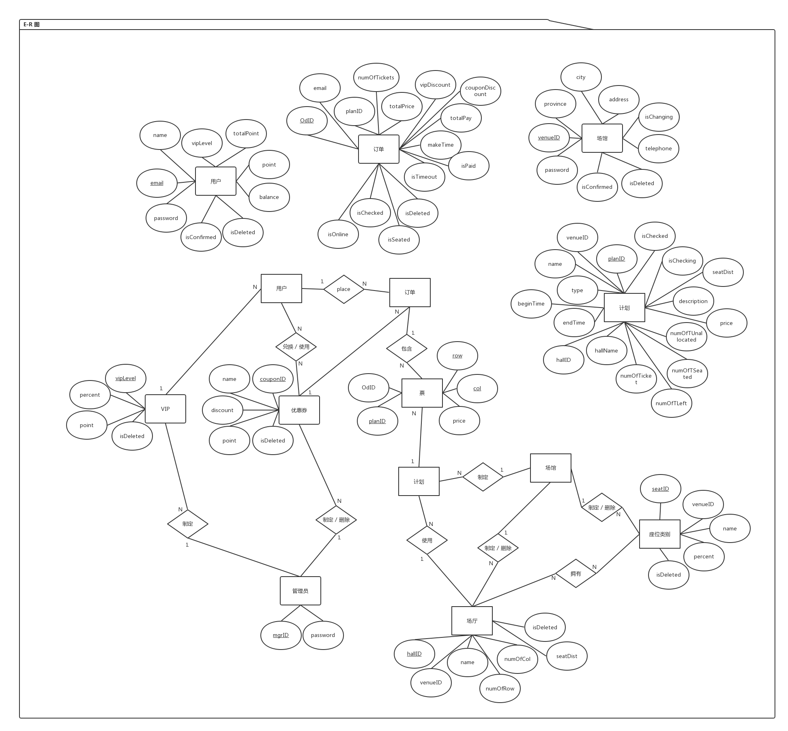
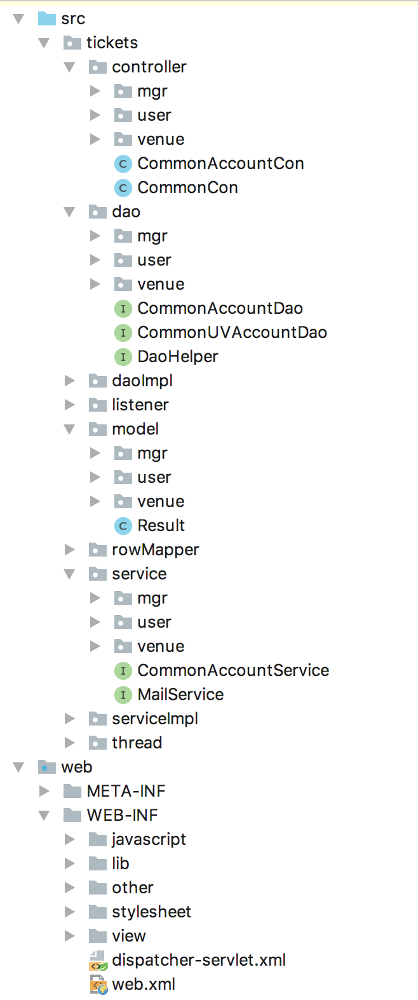

## 一 - 数据库设计

### E-R 图




### 数据库表

```sql
DROP TABLE IF EXISTS userAccount ;
CREATE TABLE userAccount(
  email VARCHAR(30) ,
  password VARCHAR(30) NOT NULL ,
  isConfirmed BOOLEAN DEFAULT FALSE ,
  isDeleted BOOLEAN DEFAULT FALSE ,
  PRIMARY KEY( email )
)ENGINE=InnoDB DEFAULT CHARSET=utf8;

DROP TABLE IF EXISTS userInfo ;
CREATE TABLE userInfo(
  email VARCHAR(30) ,
  name VARCHAR(30) NOT NULL ,
  vipLevel INT UNSIGNED NOT NULL DEFAULT 0 ,
  balance DOUBLE NULL DEFAULT 0 ,
  point INT UNSIGNED NOT NULL DEFAULT 0 ,
  totalPoint INT UNSIGNED NOT NULL DEFAULT 0 ,
  PRIMARY KEY( email )
)ENGINE=InnoDB DEFAULT CHARSET=utf8;

DROP TABLE IF EXISTS userCoupon ;
CREATE TABLE userCoupon(
  email VARCHAR(30) ,
  couponID VARCHAR(7) ,
  number INT UNSIGNED NOT NULL ,
  PRIMARY KEY( email, couponID ) ,
  FOREIGN KEY (couponID) REFERENCES couponInfo(couponID)
)ENGINE=InnoDB DEFAULT CHARSET=utf8;

DROP TABLE IF EXISTS userOd ;
CREATE TABLE userOd(
  OdID VARCHAR(14),
  email VARCHAR(30) NOT NULL ,
  planID VARCHAR(15) NOT NULL ,
  numOfTicket INT UNSIGNED NOT NULL ,
  totalPrice DOUBLE UNSIGNED NOT NULL ,
  vipDiscount DOUBLE UNSIGNED NOT NULL ,
  couponDiscount INT UNSIGNED NOT NULL ,
  totalPay DOUBLE UNSIGNED NOT NULL ,
  makeTime DATETIME NOT NULL ,
  isPaid BOOLEAN NOT NULL ,
  isTimeout BOOLEAN NOT NULL ,
  isDeleted BOOLEAN NOT NULL ,
  isSeated BOOLEAN NOT NULL ,
  isChecked BOOLEAN NOT NULL ,
  isOnline BOOLEAN NOT NULL ,
  PRIMARY KEY( OdID ) ,
  FOREIGN KEY (email) REFERENCES userAccount(email),
  FOREIGN KEY (planID) REFERENCES venuePlan(planID)
)ENGINE=InnoDB DEFAULT CHARSET=utf8;

DROP TABLE IF EXISTS userOdSeat ;
CREATE TABLE userOdSeat(
  OdID VARCHAR(14) NOT NULL ,
  planID VARCHAR(15) NOT NULL ,
  row INT UNSIGNED NOT NULL ,
  col INT UNSIGNED NOT NULL ,
  price DOUBLE UNSIGNED NOT NULL ,
  PRIMARY KEY( planID, row, col ) ,
  FOREIGN KEY (planID) REFERENCES venuePlan(planID)
)ENGINE=InnoDB DEFAULT CHARSET=utf8;

DROP TABLE IF EXISTS vipInfo ;
CREATE TABLE vipInfo(
  vipLevel VARCHAR(2) ,
  percent INT UNSIGNED NOT NULL DEFAULT 100 ,
  point INT UNSIGNED NOT NULL DEFAULT 0 ,
  isDeleted BOOLEAN NOT NULL DEFAULT 0,
  PRIMARY KEY( vipLevel )
)ENGINE=InnoDB DEFAULT CHARSET=utf8;

DROP TABLE IF EXISTS couponInfo ;
CREATE TABLE couponInfo(
  couponID VARCHAR(7) ,
  name VARCHAR(30) NOT NULL ,
  discount DOUBLE UNSIGNED NOT NULL ,
  point INT UNSIGNED NOT NULL ,
  isDeleted BOOLEAN NOT NULL DEFAULT 0,
  PRIMARY KEY( couponID )
)ENGINE=InnoDB DEFAULT CHARSET=utf8;

DROP TABLE IF EXISTS venueAccount ;
CREATE TABLE venueAccount(
  venueID VARCHAR(7) ,
  password VARCHAR(30) NOT NULL ,
  isConfirmed BOOLEAN DEFAULT FALSE ,
  isDeleted BOOLEAN DEFAULT FALSE ,
  PRIMARY KEY( venueID )
)ENGINE=InnoDB DEFAULT CHARSET=utf8;

DROP TABLE IF EXISTS venueBaseInfo ;
CREATE TABLE venueBaseInfo(
  venueID VARCHAR(7) ,
  province VARCHAR(15) NOT NULL ,
  city VARCHAR(15) NOT NULL ,
  address VARCHAR(30) NOT NULL ,
  telephone VARCHAR(11) NOT NULL ,
  isChanging BOOLEAN NOT NULL ,
  PRIMARY KEY( venueID )
)ENGINE=InnoDB DEFAULT CHARSET=utf8;

DROP TABLE IF EXISTS venueBaseInfoChange ;
CREATE TABLE venueBaseInfoChange(
  venueID VARCHAR(7) ,
  province VARCHAR(15) NOT NULL ,
  city VARCHAR(15) NOT NULL ,
  address VARCHAR(30) NOT NULL ,
  telephone VARCHAR(11) NOT NULL ,
  PRIMARY KEY( venueID )
)ENGINE=InnoDB DEFAULT CHARSET=utf8;

DROP TABLE IF EXISTS venueHall ;
CREATE TABLE venueHall(
  hallID VARCHAR(15) ,
  venueID VARCHAR(7) NOT NULL ,
  name VARCHAR(30) NOT NULL ,
  numOfRow INT UNSIGNED NOT NULL ,
  numOfCol INT UNSIGNED NOT NULL ,
  seatDist VARCHAR(100) NOT NULL ,
  isDeleted BOOLEAN NOT NULL ,
  FOREIGN KEY (venueID) REFERENCES venueAccount(venueID),
  PRIMARY KEY( hallID )
)ENGINE=InnoDB DEFAULT CHARSET=utf8;

DROP TABLE IF EXISTS venueSeatLevel ;
CREATE TABLE venueSeatLevel(
  seatID VARCHAR(15) ,
  venueID VARCHAR(7) NOT NULL ,
  name VARCHAR(15) NOT NULL ,
  percent INT UNSIGNED NOT NULL ,
  isDeleted BOOLEAN NOT NULL ,
  FOREIGN KEY (venueID) REFERENCES venueAccount(venueID),
  PRIMARY KEY( seatID )
)ENGINE=InnoDB DEFAULT CHARSET=utf8;

DROP TABLE IF EXISTS venueHallSeat ;
CREATE TABLE venueHallSeat(
  hallID VARCHAR(15) ,
  row INT UNSIGNED NOT NULL ,
  col INT UNSIGNED NOT NULL ,
  seatID VARCHAR(15) NOT NULL ,
  state VARCHAR(15) NOT NULL ,
  FOREIGN KEY (seatID) REFERENCES venueSeatLevel(seatID),
  PRIMARY KEY( hallID, row, col )
)ENGINE=InnoDB DEFAULT CHARSET=utf8;

DROP TABLE IF EXISTS venuePlan ;
CREATE TABLE venuePlan(
  planID VARCHAR(15) ,
  venueID VARCHAR(7) NOT NULL ,
  name VARCHAR(30) NOT NULL ,
  type VARCHAR(15) NOT NULL ,
  beginTime DATETIME NOT NULL ,
  endTime DATETIME NOT NULL ,
  hallID VARCHAR(15) NOT NULL ,
  hallName VARCHAR(30) NOT NULL ,
  numOfTicket INT UNSIGNED NOT NULL ,
  numOfTLeft INT UNSIGNED NOT NULL ,
  numOfTSeated INT UNSIGNED NOT NULL ,
  numOfTUnallocated INT UNSIGNED NOT NULL ,
  price DOUBLE UNSIGNED NOT NULL ,
  description VARCHAR(100) NOT NULL ,
  seatDist VARCHAR(100) NOT NULL ,
  isChecking BOOLEAN NOT NULL ,
  isChecked BOOLEAN NOT NULL ,
  PRIMARY KEY( planID ) ,
  FOREIGN KEY (venueID) REFERENCES venueAccount(venueID) ,
  FOREIGN KEY (hallID) REFERENCES venueHall(hallID)
)ENGINE=InnoDB DEFAULT CHARSET=utf8;

DROP TABLE IF EXISTS mgrAccount ;
CREATE TABLE mgrAccount(
  mgrID VARCHAR(7) ,
  password VARCHAR(15) NOT NULL ,
  PRIMARY KEY( mgrID )
)ENGINE=InnoDB DEFAULT CHARSET=utf8;
```


## 二 - 架构设计

1. 
2. 使用 SpringMVC
3. 未使用框架


## 三 - 类设计

### Controller

#### mgr/

```
commonMgr
	对管理员界面 return 和 重定向 进行统一管理
MgrExamineVenueInfoChangeCon
	对场馆信息修改界面请求进行处理
	显示处理场馆信息修改请求界面
	处理 同意场馆信息修改 的请求
MgrExamineVenueRegisterCon
	对场馆注册信息界面请求进行处理
	显示处理场馆注册请求界面
	处理 同意场馆注册 请求
MgrInfoCon
	对管理员信息界面请求进行处理
MgrSettleUserOdCon
	对已完成用户订单进行结算处理
	显示处理还未结算的订单界面
	处理 结算订单 的请求
MgrStatisticCon
	显示用户和场馆的信息统计界面
MgrVIPDiscountCon
	显示现有VIP等级优惠政策和可兑换优惠券
	处理 修改VIP等级优惠 / 增删优惠券 的请求
```

#### usr/

```
CommonUser
	对用户界面 return 和 重定向 进行统一管理
UserAccountCon
	显示用户注册界面
	处理发送验证码的请求
	处理用户注册的请求
	处理注销会员请求
UserCouponCon
	显示用户拥有的优惠券的信息
	显示可以用于兑换的优惠券
	处理兑换优惠券请求
UserInfoCon
	显示用户信息
	处理修改用户信息的请求
	获得用户VIP等级优惠信息
UserOdCon
	显示用户订单界面
	处理用户搜索计划的请求
	处理获得计划座位信息的请求
	处理获得计划场馆信息的请求
	处理选座订票的请求
	处理不选座订票的请求
	处理支付订单的请求
	处理订单取消的请求
	获得用户历史订单
	获得用户超时订单
	获得用户退订订单
	获得用户未来订单
	获得用户未完成订单
	获得订单对应计划信息
	获得订单对应座位信息
```

#### venue/

```
CommonVenue
	对场馆界面 return 和 重定向 进行统一管理
VenueAccountCon
	显示场馆注册界面
	处理场馆注册请求
VenueBaseInfoCon
	显示场馆信息界面
	处理场馆修改信息请求
VenueHallManageCon
	显示场馆所有场厅信息
	处理场馆新建场厅请求
	处理场馆删除场厅请求
VenueOdCon
	处理场馆线下购票请求
	处理场馆获得用户VIP等级优惠请求
	处理场馆获得用户所有优惠券请求
	处理场馆支付订单请求
	处理场馆取消订单请求
	处理场馆检票请求
	处理场馆获得用户订单座位请求
	处理场馆获得计划订单请求
VenuePlanManageCon
	显示场馆场厅信息
	处理场馆新增场厅请求
	获得所有未检票场厅
	获得所有正在检票场厅
	获得所有已完成检票场厅
	获得计划相关场厅座位分布信息
	处理计划开始检票请求
	处理计划完成检票请求
	获得计划所有已检票座位
VenueSeatLevelManageCon
	显示场馆座位类别信息
	处理场馆新增座位类别的请求
	处理场馆删除座位类别的请求
```

```
CommonAccountCon
	显示登录界面
	处理用户或场馆登出请求
	处理非授权用户越权访问问题
	处理错误访问地址
CommonCon
	对登录界面的 return 和 重定向 进行统一管理
	判定用户身份类别
	创建 session
	对字符串进行者则表达式的检测
```


### daoImpl

#### mgr/

```
MgrAccountDaoImpl
	管理员登录验证
MgrCouponDaoImpl
	新增优惠券
	删除优惠券
	查找所有优惠券ID
	查找所有可兑换优惠券ID
	查找优惠券信息
MgrVIPLevelDaoImpl
	新增VIP等级优惠信息
	查看所有VIP等级优惠信息
```

#### user/

```
UserAccountDaoImpl
	用户登录验证
	检测账户是否验证
	检测账户是否删除
	搜索所有用户邮箱
	验证用户验证码
	检测账户是否存在
	新增账户
	更新用户账号验证码
	删除账户
UserCouponDaoImpl
	搜索用户所有优惠券
	新增一个用户优惠券
	删除一个用户优惠券
UserInfoDaoImpl
	搜索用户信息
	更新用户信息
	更新用户余额
	更新用户VIP等级
	搜索所有用户信息
UserOdDaoImpl
	新增用户选座购票订单
	新增用户不选座购票订单
	插入用户订单座位
	新增用户订单
	搜索用户订单信息
	搜索用户所有订单ID
	搜索计划所有已售座位信息
	搜索计划已检票座位信息
	删除用户订单对应座位信息
	更新用户订单是否付钱
	更新用户订单是否退订
	更新用户订单是否超时
	更新用户订单是否安排座位
	更新用户订单是否结算
	搜索用户所有历史订单
	搜索用户所有超时订单
	搜索用户所有退订订单
	搜索用户所有未来订单
	搜索用户所有未完成订单
	搜索计划所有相关订单信息
	搜索计划已检票座位信息
	搜索计划未检票订单信息
	更新用户订单是否检票
	搜索所有已经检票但未结算的订单信息
	搜有用户所有订单信息
```

#### venue/

```
VenueAccountDaoImpl
	场馆登录验证
	检测账户是否验证
	检测账户是否删除
	搜索所有场馆ID
	新增账户
	更新场馆是否认证
VenueBaseInfoDaoImpl
	新增场馆信息
	搜索所有未认证场馆信息
	搜索场馆信息
	更新场馆信息
	搜索场馆更新的信息
	搜索所有场馆信息
VenueHallDaoImpl
	新增场馆场厅
	搜索所有场厅ID
	搜索所有场厅信息
	删除场厅
	搜索场厅信息
	搜索场厅座位信息
VenuePlanDaoImpl
	搜索所有计划ID
	新增计划
	搜索场馆未检票计划
	搜索场馆正在检票计划
	搜索场馆已完成检票计划
	根据名称模糊搜索计划
	搜索计划信息
	更新计划座位分布信息
	更新计划票数信息
	更新计划正在检票
	更新计划已完成检票
	搜索所有未来的计划
	搜索场馆所有计划
VenueSeatLevelDaoImpl
	新增座位等级信息
	删除座位等级信息
	搜索所有座位等级信息
```

```
Common
	登录验证
	检测帐号是否验证
	检测帐号是否删除
DaoHelperImpl
	数据库连接
	连接关闭
ParaName
	变量统一管路
```


### listener

```
AllocateSeatToUserOdIsNotSeatedListener
	自动分配座位
CheckUserOdIsTimeoutListener
	检测用户订单是否超时
```


### model

#### mgr/

```
CouponInfo
	优惠券信息
UserStatistic
	用户统计信息
VenueStatistic
	场馆统计信息
VIPLevelInfo
	VIP等级优惠信息
```

#### user/

```
UserCoupon
	用户优惠券信息
UserInfo
	用户信息
UserOd
	用户订单信息
UserOdSeat
	用户订单座位信息
```

#### venue/

```
VenueBaseInfo
	场馆信息
VenueBaseInfoChange
	场馆信息更新
VenueHall
	场厅信息
VenueHallSeat
	场厅座位类别信息
VenuePlan
	计划信息
VenuePlanSeat
	计划座位信息
VenueSeatLevel
	座位类别信息
```


### serviceImpl

#### mgr/

```
MgrAccountServiceImpl
	管理员登录
MgrCouponServiceImpl
	新增优惠券
	删除优惠券
	获得所有优惠券信息
MgrExamineVenueInfoChangeServiceImpl
	同意场馆信息修改
MgrExamineVenueRegisterServiceImpl
	同意场馆注册
MgrStatisticsServiceImpl
	获得所有用户统计信息
	获得所有场馆统计信息
MgrVIPLevelServiceImpl
	设置VIP等级优惠信息
	获得所有VIP等级优惠信息
```

#### user/

```
UserAccountServiceImpl
	用户登陆
	账户是否存在
	用户注册
	账户注销
UserCouponServiceImpl
	获得用户所有优惠券
	兑换优惠券
	获得所有可兑换优惠券
UserInfoServiceImpl
	获得用户信息
	修改用户信息
	更新用户VIP信息
UserOdServiceImpl
	根据计划名称搜索计划
	选座下订单
	不选座下订单
	订单付钱
	订单取消
	获得用户历史订单
```

#### venue/

```
VenueAccountServiceImpl
	场馆登录
	场馆注册
VenueBaseInfoServiceImpl
	获得所有未认证场馆信息
	获得场馆信息
	检测场馆是否存在未许可的信息修改
	修改场馆信息
VenueHallServiceImpl
	新增场厅
	获得所有场厅信息
	删除场厅
VenueOdServiceImpl
	获得用户VIP等级优惠
	获得用户所有优惠券
VenuePlanServiceImpl
	新增计划
	获得所有未检票计划
	获得所有正在检票计划
	获得所有已完成检票计划
	更新计划座位分布
	获得计划对应场馆座位分布信息
	为用户订单分配座位
VenueSeatLevelServiceImpl
	新增座位类别
	删除座位类别
	获得所有座位类别信息
```

```
CommonService
	随机生成不重复ID号
	座位分布图字母转4进制
	座位分布4进制转字母
	01串转16进制
	16进制转01串
	4进制转16进制
	16进制转4进制
	
```

```
MailServiceImpl
	发送邮件
```


### thread

```
AllocateSeatToUserOdIsNotSeatedThread
	自动分配座位
CheckUserOdIsTimeoutThread
	检测订单是否超时
```


### View

#### mgr/

```
MgrInfo.jsp
	管理员信息界面
	登录注销
MgrExamineVenueInfoChange.jsp
	认证场馆信息修改
MgrExamineVenueRegister.jsp
	认证场馆注册
MgrSettleUserOd.jsp
	用户订单结算
MgrSetVIPDiscount.jsp
	设置VIP等级优惠
	新增删除优惠券
MgrStatistics.jsp
	用户和场馆统计信息展示
```

#### user/

```
UserRegister.jsp
	用户注册信息填写
	发送验证码
UserInfo.jsp
	用户信息显示
	用户信息修改
	会员注销
	登录注销
UserCoupon.jsp
	查看优惠券信息和数量
	查看可兑换优惠券
	兑换优惠券
UserOrder.jsp
	查看历史订单
	查看超时订单
	查看退订订单
	查看未来订单
	查看未完成订单
	查看订单详细信息
	未完成订单付钱
	取消未完成订单
	取消未来订单
UserBuyTicket.jsp
	根绝名称搜索计划
	选座买票
	不选座买票
	立即付款
	稍后付款
```

#### venue/

```
VenueRegister.jsp
	场馆注册
VenueBaseInfo.jsp
	显示场馆信息
	修改场馆信息
	登录注销
VenueSeatLevelManage.jsp
	查看现存座位类别信息
	新增座位类别信息
	删除座位类别信息
VenueHallManage.jsp
	查看现存场厅信息
	新增场厅
	删除场厅
VenuePlanManage.jsp
	查看未检票订单
	查看正在检票订单
	查看已完成检票订单
	新增计划
	计划检票
	未检票订单线下购票
	计划完成检票
	查看计划信息
	查看计划相关订单信息
```


## 四 - 其他

数据库：mysql

服务器：tomcat 9.0.0

JDK：1.8

心得：前期对项目总体规划比较重要

